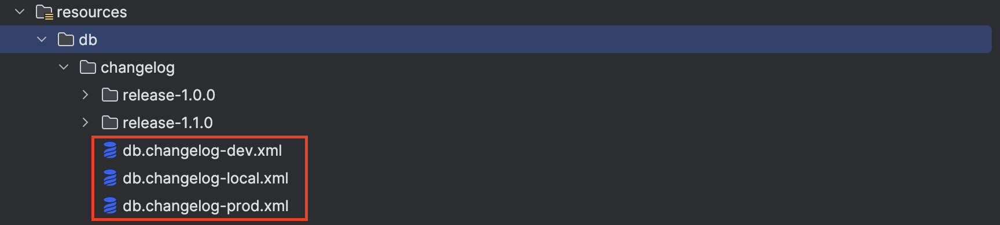
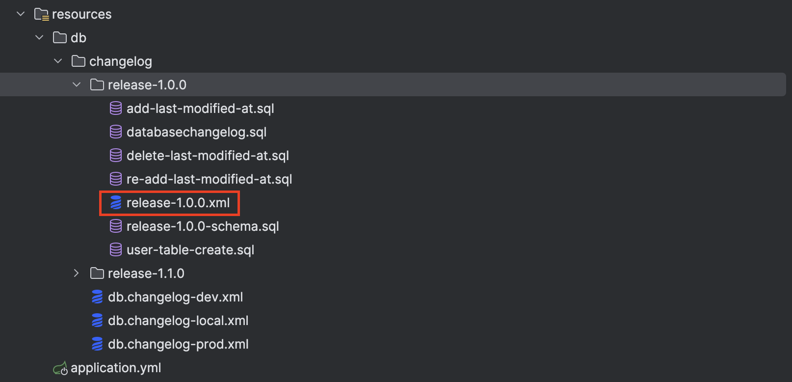
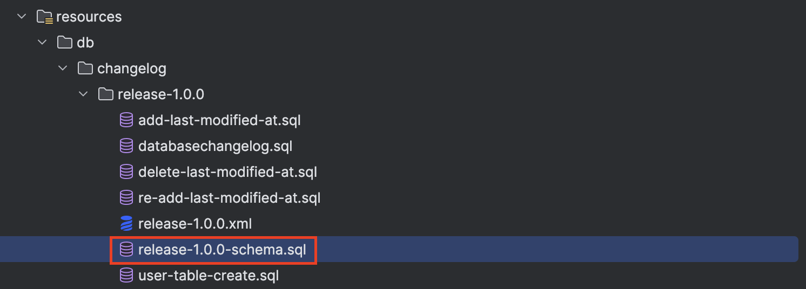
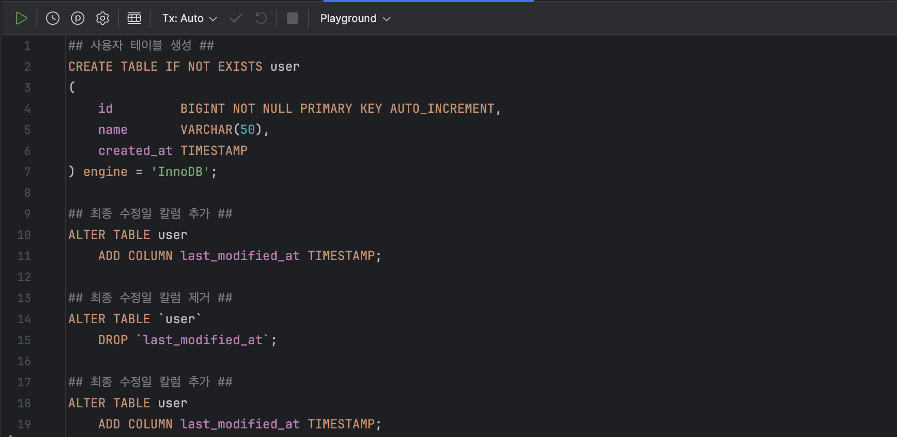

# Liquibase

<br/>

<div align="center">


<br/>
<br/>

Liquibase is an open-source database-independent library for tracking, <br/>
managing and applying database schema changes.

</div>


<div align="center">

[](https://contribute.liquibase.com/extensions-integrations/directory/database-tutorials/cloud-spanner/) [](https://github.com/liquibase/liquibase)


</div>

<br/><br/><br/><br/><br/>

## 1. Getting Started

프로젝트 실행 전 .yml 파일을 설정해주세요. 도커 설정 파일은 docker 폴더 내부에 있습니다.

> Java17 / Kotlin1.7 버전 이상의 JDK를 설치해야 합니다.

<br/><br/><br/>

## Run Application

````text
$ ./gradlew bootRun
````

<br/><br/><br/>

## Run Test

````text
$ ./gradlew test
````

<br/><br/><br/>

## Run Build

````text
$ ./gradlew build
````

<br/><br/><br/><br/><br/><br/>

## 2. 스키마 관리

적용한 스키마(schema) 관리 방법은 다음과 같습니다.

1. 각 개발 환경(local, dev, prod) db.changelog.xml 생성
2. 각 배포 버전마다 폴더 및 .xml 생성
3. 최종 반영 스키마 파일 생성

<br/><br/><br/><br/>

### 2-1. 각 개발 환경 db.changelog.xml 생성

각 개발 환경에 맞는 db.changelog.xml을 생성합니다. local, dev에서 안정된 파일을 prod에 적용하며, `prod는 데이터베이스 스키마를 수동으로 반영`하기 때문에 반드시 파일을 생성할 필요는
없습니다.



<br/><br/><br/><br/><br/><br/>

### 2-2. 배포 버전 별 폴더 및 .xml 생성

배포 버전 별 폴더를 생성하고, 이를 관리할 .xml 파일을 생성합니다. `.xml 파일을 통해 해당 버전의 스키마 변경 이력을 관리`합니다.



> 즉, 모든 변경 이력은 버전 별 .xml 파일을 통해 추적/관리 되는 것입니다.

<br/><br/><br/><br/>

`변경할 스키마는 .sql 형태로 폴더 내에 관리`하며, 이는 `.xml 파일에 포함`되도록 설정합니다.

```xml
<?xml version="1.0" encoding="UTF-8"?>
<databaseChangeLog
        xmlns="http://www.liquibase.org/xml/ns/dbchangelog"
        xmlns:xsi="http://www.w3.org/2001/XMLSchema-instance"
        xsi:schemaLocation="http://www.liquibase.org/xml/ns/dbchangelog http://www.liquibase.org/xml/ns/dbchangelog/dbchangelog-3.1.xsd">
    <changeSet id="v1.0.0/datachangelog/table-create" author="jun" context="dev">
        <comment>데이터베이스 스키마 관리 테이블 생성</comment>
        <sqlFile path="databasechangelog.sql" relativeToChangelogFile="true"/>
    </changeSet>
    <changeSet id="v1.0.0/user/table-create" author="jun" context="dev">
        <comment>사용자 테이블 생성</comment>
        <sqlFile path="user-table-create.sql" relativeToChangelogFile="true"/>
    </changeSet>
    <changeSet id="v1.0.0/user/column-add/last-modified-at" author="jun" context="dev">
        <sqlFile path="add-last-modified-at.sql" relativeToChangelogFile="true"/>
    </changeSet>
    <changeSet id="v1.0.0/user/column-delete/last-modified-at" author="jun" context="dev">
        <sqlFile path="delete-last-modified-at.sql" relativeToChangelogFile="true"/>
    </changeSet>
</databaseChangeLog>
```

<br/><br/><br/><br/><br/><br/>

### 2-3. 최종 반영 스키마 파일 생성

배포 환경에 적용할 `최종 스키마 파일을 생성`하고, `변경된 내용을 반영`합니다.





<br/><br/><br/><br/><br/><br/>

## 3. 스키마 변경내역 

스키마 변경 내역을 엔티티로 만들면, 변경 이력을 UI로 제공할 수 있습니다.

```kotlin
@Entity(name = "databasechangelog")
@Table(name = "databasechangelog")
data class DatabaseChangelog(
    @Id
    @Column(name = "ID", length = 255, nullable = false)
    var id: String,

    @Column(name = "AUTHOR", length = 255, nullable = false)
    var author: String,

    @Column(name = "FILENAME", length = 255, nullable = false)
    var fileName: String,

    @Column(name = "DATEEXECUTED", nullable = false)
    var dateExecuted: LocalDateTime,

    @Column(name = "ORDEREXECUTED", nullable = false)
    var orderExecuted: Int,

    @Column(name = "EXECTYPE", length = 10, nullable = false)
    var execType: String,

    @Column(name = "MD5SUM", length = 35)
    var md5Sum: String? = null,

    @Column(name = "DESCRIPTION", length = 255)
    var description: String? = null,

    @Column(name = "COMMENTS", length = 255)
    var comments: String? = null,

    @Column(name = "TAG", length = 255)
    var tag: String? = null,

    @Column(name = "LIQUIBASE", length = 20)
    var liquibase: String? = null,

    @Column(name = "CONTEXTS", length = 255)
    var contexts: String? = null,

    @Column(name = "LABELS", length = 255)
    var labels: String? = null,

    @Column(name = "DEPLOYMENT_ID", length = 10)
    var deploymentId: String? = null
)
```

<br/><br/><br/><br/><br/><br/>

## 4. 주의 사항

prod 환경을 자동화에 의존하면 문제가 발생할 수 있기 때문에 가급적 local, dev에서 사용하도록 합니다. 또한, Liquibase는 Tag나 RollbackCount를 통해 특정 지점으로
Rollback할 수 있는데, 이는 어떤 부작용을 일으킬지 알 수 없으므로, 신중히 적용하도록 합니다.

1. prod 환경에는 가급적 적용하지 않는다.
2. Rollback은 신중히 적용한다.  
